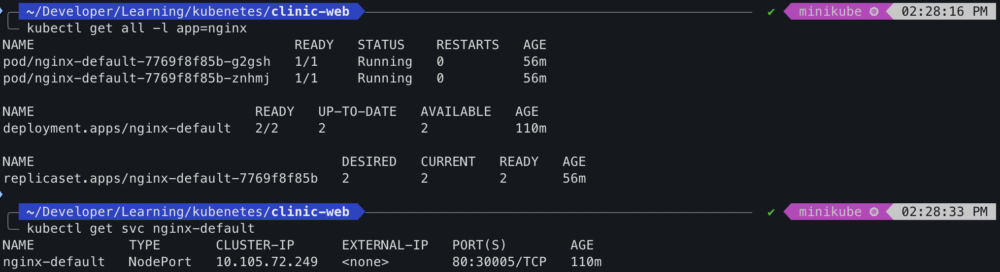
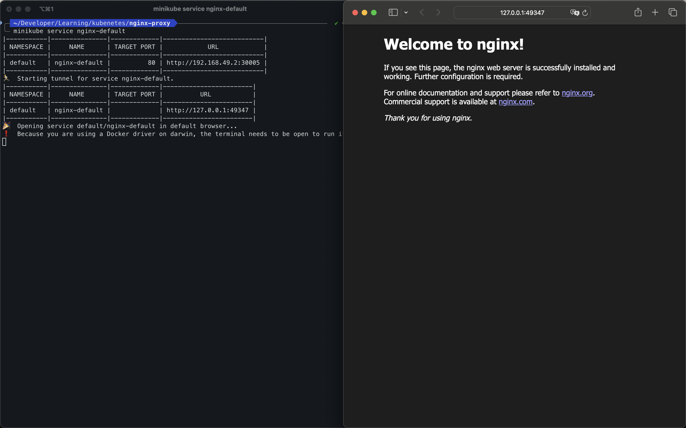
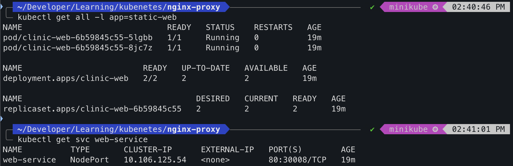
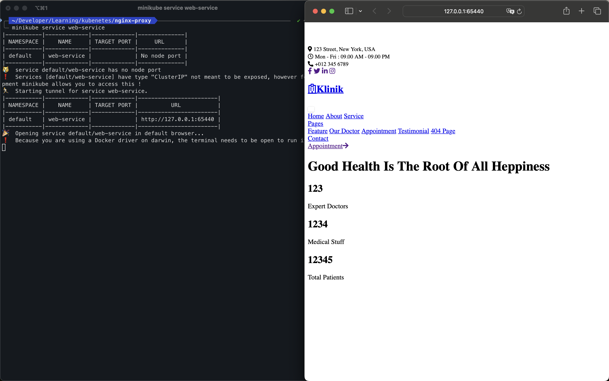
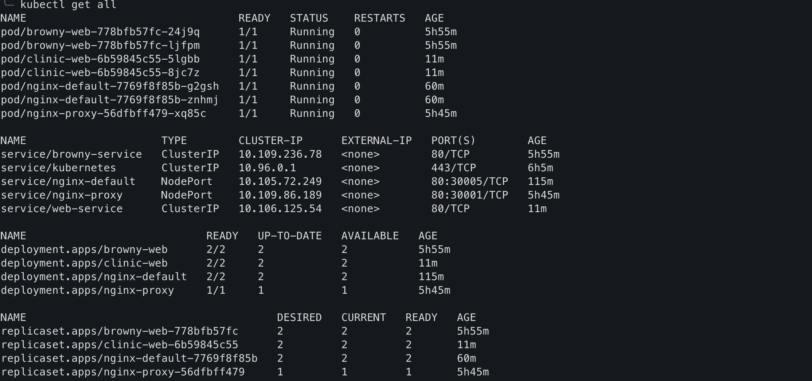
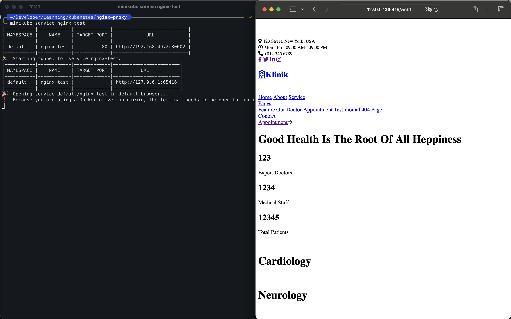
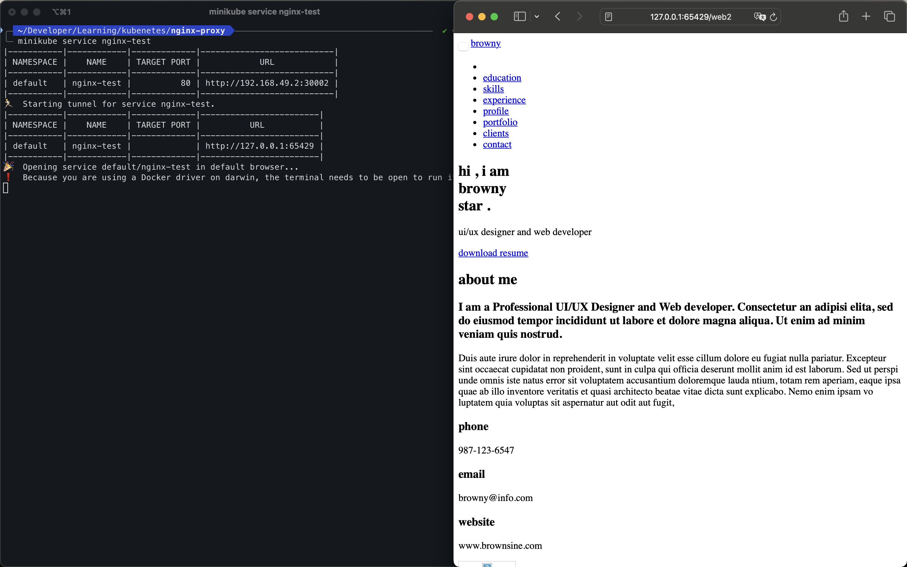

# Kubernetes Course Challenge Labs
---
## 🚀 Introduction
This repository contains solutions to three hands-on lab challenges from my **Viettel High Tech (VHT)** Kubernetes course. The labs focus on deploying, configuring, and managing containerized applications using Kubernetes resources like Deployments and Services. 

## 🔧 Prerequisites
Ensure you have the following tools installed:
- [Docker](https://www.docker.com/)
- [Minikube](https://minikube.sigs.k8s.io/docs/start/)
- [Kubectl](https://kubernetes.io/docs/tasks/tools/)
- A web browser for testing deployed applications
> **📝 Note**: Make sure you have `minikube` running before deploying any services. Use the command:
> ```bash
> minikube start
> ```
---

## 🛠️ Lab Challenges Overview
> **📝 Note**: This project was developed and tested on a **macOS** environment. Due to macOS network limitations with `minikube`, I used minikube tunnel to access the services deployed using **NodePort**:
> ```
> minikube service <service-name> 
> ```
>  This is necessary because the default method of accessing services via NodePort does not work seamlessly on macOS. Refer to these links for more details
> (https://minikube.sigs.k8s.io/docs/handbook/accessing/), (https://github.com/kubernetes/minikube/issues/11193).


### Challenge 1: Default nginx - Basic
**Objective**: Deploy using default NGINX image and expose it via a NodePort service.

**Detail** *(In Vietnamese)*:

> Đề bài: triển khai deployment chạy nginx (default) lên kubernetes và cho phép truy cập từ bên ngoài thông qua NodePort
> Output:
> - 1 deployment nginx (replicas=2 pod)
> - 1 nodePort service trỏ tới deployment
> - thực hiên curl tới nodePort và cho ra kết quả trang web mặc định của nginx

#### 📝 Step-by-step Process

   - Created `nginx-default.yaml` file with the default NGINX image.
   - Applied the deployment and service:
     ```bash
     kubectl apply -f nginx-default.yaml
     ```
     
     Or using imperative approach by exposing the deployment using a NodePort service:
     ```bash
     kubectl expose deployment nginx-default --type=NodePort --port=80
     ```
  - Check the state of deployment and service:
    ```
    kubectl get all -l app=nginx
    kubectl get svc nginx-default
    ```

    

    
   - Accessed the website:
     ```bash
     minikube service nginx-default
     ```
     
   


---

### Challenge 2: Static web pod - Intermediate
**Objective**: Deploy a static website using NGINX in a Kubernetes cluster and expose it via a NodePort service.

**Detail** *(In Vietnamese)*:

> **Đề bài**: Triển khai deployment một ứng dụng web tĩnh lên kubernetes cho phép truy cập từ bên ngoài thông qua nodePort
> **Output**:
> - Đóng gói thành công container chứa web tĩnh
>   - Download 1 template tại (https://www.free-css.com/free-css-templates)
>   - Sử dụng base image nginx
>   - Lưu ý cấu hình nginx trỏ tới web tĩnh (tham khảo file cấu hình mẫu đơn giản
    tại https://gist.github.com/mockra/9062657)
> - 1 deployment chạy ứng dụng web tĩnh (replicas=2)
> - 1 nodePort service trỏ tới deployment (service web 1)
> - Thực hiên curl tới nodePort và cho ra kết quả trang web tĩnh theo template


#### 📝 Step-by-step Process *(`clinic-web` Directory)*
   - Download a Website Template and create a `Dockerfile`
   - Build and Push the Docker Image
     ```
     docker build -t <username>/clinic-website-template:latest .
     docker push <username>/clinic-website-template:latest
     ```
   - Created `web1-deployment.yaml` file for the static NGINX website.
   - Applied the deployment and service:
     ```bash
     kubectl apply -f web1-deployment.yaml
     ```
  - Check the state of deployment and service:
    ```
    kubectl get all -l app=static-web
    kubectl get svc web-service
    ```
    
  - Accessed the website:
    ```bash
    minikube service web-service
    ```
   
   
     


### Challenge 3: Nginx-proxy - Advanced
**Objective**: Set up an NGINX proxy to forward traffic to two separate static websites deployed in the cluster.

**Detail** *(In Vietnamese)*:

> **Đề bài**: triển khai nginx proxy cho nhiều ứng dụng
> - Từ challenge 2, triển khai thêm 1 trang web static thứ hai, khác với static web đã triển khai
> - service cho trang web tĩnh mới được lấy tên là web2
> - triển khai thêm 1 deployment nginx-proxy đóng vai trò proxy cho cả 2 ứng dụng trên và tạo nodePort service có tên "nginx-proxy“
> - thiết lập cấu hình config của nginx-proxy sao cho:
>   - khi gọi tới nginx-proxy với path /web1 > nginx-proxy filter path và forward tới service web 1 > service web1
>   - khi gọi tới nginx-proxy với path /web2 > nginx-proxy filter path và forward tới service web 2 > service web2
> **Output**:
> - curl http://\<node-ip>:\<node-port>/web1 > trả về static web 1
> - curl http://\<node-ip>:\<node-port>/web2 > trả về static web 2

#### 📝 Step-by-step Process 
1. **Deploying Websites** *(`clinic-web`, `browny-web` Directories)*
   - Built Docker images for two static websites (`clinic-website-template` and `browny-website`).
     ```bash
     docker build -t <username>/clinic-website-template:latest .
     docker build -t <username>/browny-website:latest  .
     ```
   - Created deployments and services:
     ```bash
     kubectl apply -f web1-deployment.yaml
     kubectl apply -f web2-deployment.yaml
     ```
   - Check the state of deployments and services:
    ```
    kubectl get all
    ```
    

2. **Setting up NGINX Proxy** *(`nginx-test` Directory)*
   - Configured `nginx.conf` to route `/web1` to `clinic-website-template` service and `/web2` to `browny-website` service.
   - Built the NGINX proxy Docker image:
     ```bash
     docker build -t <username>/nginx-test:latest  .
     ```
   - Created deployment and NodePort service for the proxy:
     ```bash
     kubectl apply -f nginx-test.yaml
     ```
   - Accessed the proxy using `minikube service nginx-test`.
      - /web1 (clinic-web):
   
      - /web2 (browny-web):
   


